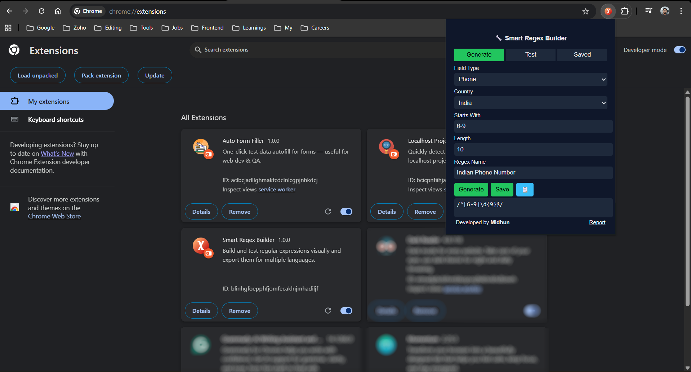
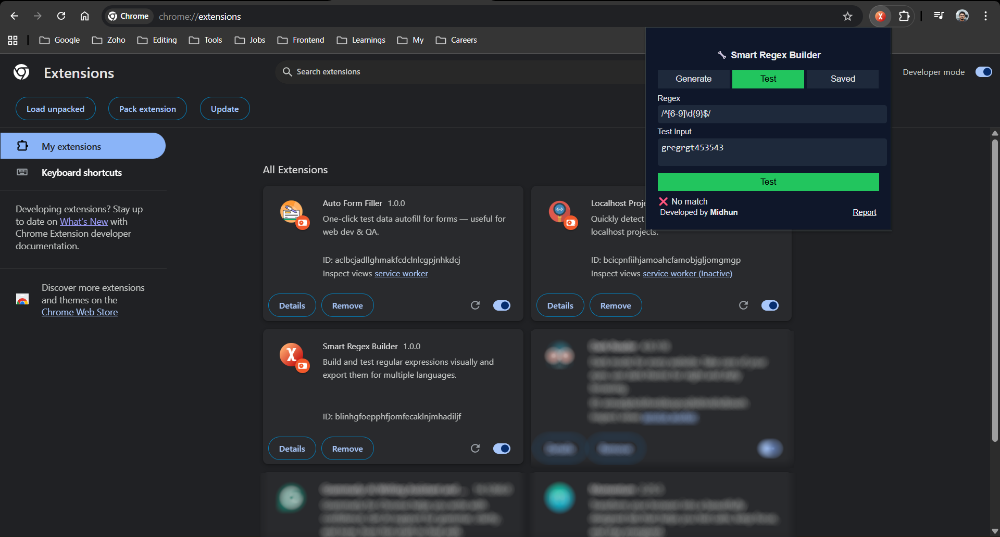
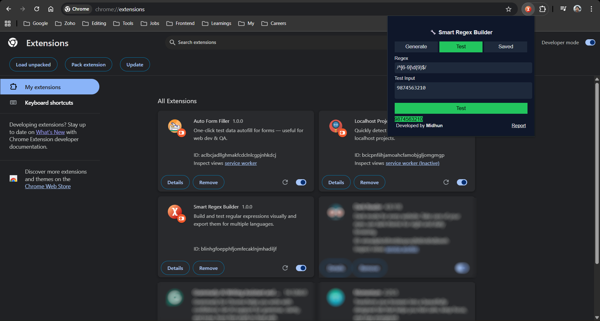
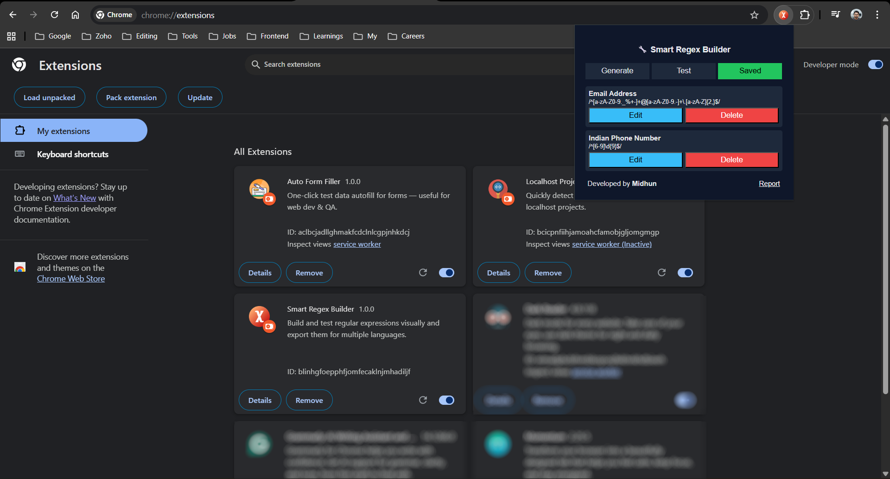

# 🔧 Smart Regex Builder

Smart Regex Builder is a developer-focused Chrome extension that helps you **generate, test, and manage regular expressions** for real-world form validation and security use cases.

It is designed for everyday developer workflows and works completely **offline**, with no external dependencies.

---

## ✨ Features

### 🧩 Generate Regex
- Generate regex for common form fields:
  - Email
  - Phone (India / USA / UK)
  - Username
  - Name
  - Numbers
  - Alphanumeric
- Prevent unsafe characters to reduce SQL injection risks
- Custom start patterns and length control
- Copy regex to clipboard with one click

### 🧪 Test Regex
- Paste any regex
- Test against custom input
- Manual test trigger
- Highlight matched content

### 💾 Saved Templates
- Save regex templates with a custom name
- Edit saved regex back into the generator
- Delete unused regex patterns
- All data stored locally in browser storage

---

## 🔐 Security Notes

- This extension helps with **input validation only**
- Regex alone does **not** prevent SQL injection
- Always use:
  - Parameterized queries
  - ORM / prepared statements on the backend

This tool complements backend security, it does not replace it.

---

## 🖥 Installation (Local / Office Use)

1. Clone or download this repository
2. Open Chrome and navigate to:

3. Enable **Developer Mode**
4. Click **Load unpacked**
5. Select the project folder

The extension is now available in your browser toolbar.

---

## 🔐 Privacy

- No data is sent to any server
- No tracking or analytics
- All regex templates are stored locally using `chrome.storage`
- Works fully offline

---

## Screenshots

* Regex Generator

* Regex Test

* Saved Regex

---

## 🚀 Future Enhancements

- Import / export regex templates
- Regex flags support (i, g, m)
- Regex explanation in plain English
- Sidebar mode instead of popup
- Pro features for advanced validation

---

## 👤 Author

**Midhun V S**  
GitHub: https://github.com/vsmidhun21

---

> Built for developers who work with forms, validation, and security every day.
